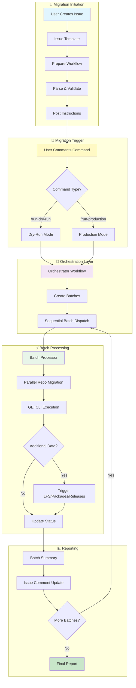
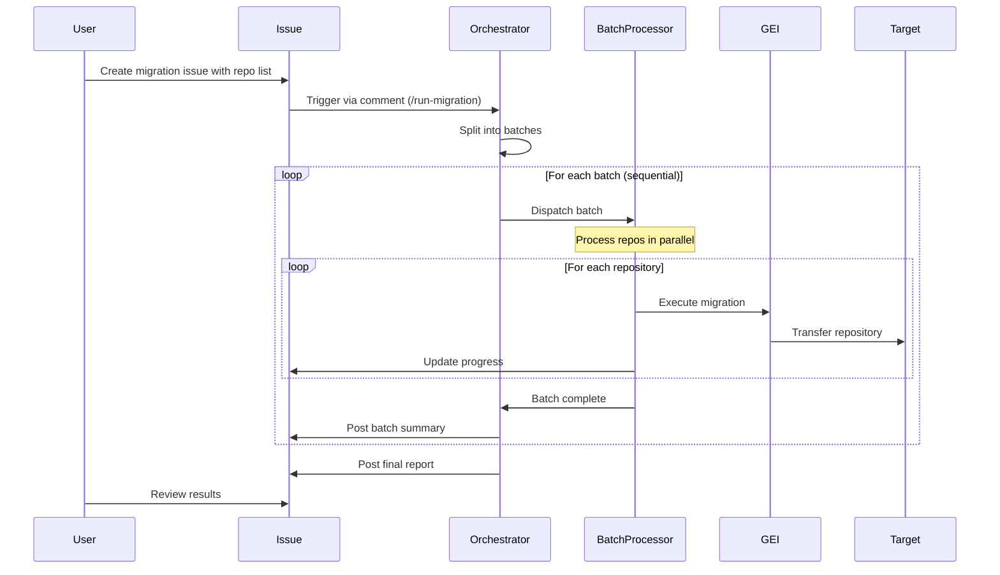

# 🚀 GitHub Enterprise Migration System

> **Self-Service, Batch-Powered Repository Migrations at Scale**

[](https://github.com)
[](https://docs.github.com/en/migrations/using-github-enterprise-importer)
[](https://github.com)

Transform your GitHub migration experience with our automated, issue-driven system that makes large-scale repository transfers simple, trackable, and reliable. Perfect for organizations moving from GitHub Enterprise Server (GHES) or between GitHub Enterprise Cloud (GHEC) organizations.

## ✨ Key Features

| Feature | Description |
|---------|------------|
| 📋 **Issue-Driven Workflow** | Create an issue, list your repos, and let automation handle the rest |
| 📦 **Smart Batching** | Automatically splits large migrations into manageable chunks (250 repos/batch) |
| 🔄 **Sequential Processing** | Reliable batch-by-batch execution with progress tracking |
| 🧪 **Dry-Run Support** | Test migrations safely before production |
| 🔒 **Production Mode** | Secure migration with source repository locking |
| 💾 **Complete Data Transfer** | Includes LFS, packages, and releases |
| 💬 **Real-Time Updates** | Progress notifications via issue comments |
| 🛑 **Cancellation Support** | Stop migrations gracefully with `/cancel-migration` |
| 👥 **User Mapping** | Automatic mannequin-to-user account mapping |
| 🔧 **Self-Service** | Empower teams to run their own migrations |

## 🏗️ Architecture Overview



## 🚦 Migration Flow



## 🎯 Quick Start

### 📋 Prerequisites

- ✅ GitHub Enterprise Cloud organization (target)
- ✅ Admin access to source and target
- ✅ Personal Access Tokens (PATs)
- ✅ Storage backend (Azure Blob or AWS S3)

### 🔧 Setup Instructions

#### 1️⃣ **Fork & Configure Repository**

```bash
# Fork this repository to your organization
# Clone to your local machine
git clone https://github.com/YOUR-ORG/migration-system.git
cd migration-system
```

#### 2️⃣ **Configure Secrets** 🔐

Navigate to **Settings** → **Secrets and variables** → **Actions**

| Secret | Description | Required |
|--------|-------------|----------|
| `TARGET_ADMIN_TOKEN` | PAT for target org with `repo`, `admin:org`, `workflow` scopes | ✅ |
| `SOURCE_ADMIN_TOKEN` | PAT for source with `repo`, `admin:org` scopes | ✅ |
| `AZURE_STORAGE_CONNECTION_STRING` | Azure storage connection string | Choose one |
| `AWS_ACCESS_KEY_ID` | AWS access key | storage option |
| `AWS_SECRET_ACCESS_KEY` | AWS secret key |  |

#### 3️⃣ **Configure Variables** ⚙️

Navigate to **Settings** → **Secrets and variables** → **Actions** → **Variables**

| Variable | Description | Example |
|----------|-------------|---------|
| `TARGET_ORGANIZATION` | Target GitHub org name | `my-company` |
| `INSTALL_PREREQS` | Auto-install dependencies | `true` |
| `AWS_REGION` | AWS region (if using S3) | `us-east-1` |
| `AWS_BUCKET_NAME` | S3 bucket name (if using S3) | `migrations` |

#### 4️⃣ **Optional: Prepare Support Files** 📁

<details>
<summary>📦 For repositories with special requirements</summary>

Create these CSV files in your repository root:

**`lfs.csv`** - Repositories requiring LFS migration
```csv
repository
https://github.example.com/org/repo-with-lfs
```

**`packages.csv`** - Repositories with packages
```csv
repository
https://github.example.com/org/repo-with-packages
```

**`user-mappings-gei.csv`** - Map mannequins to real users
```csv
source,target
old-username,new-username
```

</details>

## 🚀 Running Your Migration

### Step 1: Create Migration Issue 📝

1. Go to **Issues** → **New Issue**
2. Select **"GHES/GHEC repos to GitHub migration [GEI]"** template
3. Add your repositories:

```markdown
<details>
<summary>Click to expand repository list</summary>

https://github.example.com/org/repo1
https://github.example.com/org/repo2
https://github.example.com/org/repo3
<!-- Add all your repositories here -->

</details>
```

4. Select visibility: `Private`, `Internal`, or `Mirror`
5. Submit the issue

### Step 2: Review Automated Analysis 🔍

The system will automatically comment with:
- ✅ Number of repositories detected
- 📦 Batch breakdown (if >250 repos)
- 🎯 Target organization confirmation
- 👁️ Visibility settings

### Step 3: Start Migration 🎬

Add a comment to your issue:

#### 🧪 **Test First (Recommended)**
```
/run-dry-run-migration
```
- ✅ Safe, non-destructive test
- ✅ Creates test repos with `-dry-run-timestamp` suffix
- ✅ Source remains unlocked

#### 🚀 **Production Migration**
```
/run-production-migration
```
- ⚠️ Locks source repositories
- ✅ Creates repos with original names
- ✅ Run after successful dry-run

### Step 4: Monitor Progress 📊

Watch real-time updates in your issue:

```
🚀 Starting Dry-Run migration with 10 sequential batches
📦 Batch Size: 250 repositories per batch
⏱️ Processing: Sequential (one batch at a time)

➡️ Starting batch 1 of 10 (250 repositories)
✅ Batch 1 of 10 completed: success
➡️ Starting batch 2 of 10 (250 repositories)
...
```

### Step 5: Post-Migration 🎉

After successful migration:
- 📋 Review the final report
- 🔍 Verify all repositories
- 👥 Update team access
- 🔧 Configure CI/CD
- 📢 Notify your teams

## 🎛️ Advanced Configuration

### ⚙️ Customize Batch Size

Edit workflow configuration for your needs:

```yaml
# .github/workflows/trigger.yml
BATCH_SIZE: 250  # Adjust based on your needs
```

**Sizing Guide:**
- 🐢 **Small (50-100)**: More reliable, slower
- 🐇 **Medium (250)**: Balanced (default)
- 🚄 **Large (500+)**: Faster, may hit limits

### 🔄 Parallel Processing

Control concurrent migrations per batch:

```yaml
# .github/workflows/batch-processor.yml
max-parallel: 10  # Repos processed simultaneously
```

### ⏱️ Timeout Configuration

For large repositories:

```yaml
timeout-minutes: 50400  # Current: 35 days
```

## 🛠️ Troubleshooting

### 🚨 Common Issues & Solutions

<details>
<summary>🔴 Migration Won't Start</summary>

**Checklist:**
- ✅ Verify PAT permissions
- ✅ Check secret names match exactly
- ✅ Ensure issue has `migration` and `batch` labels
- ✅ Confirm user has write access

</details>

<details>
<summary>🟡 Batch Processing Stops</summary>

**Steps:**
1. Check Actions tab for error details
2. Verify runner availability
3. Check API rate limits
4. Re-run failed batch from Actions

</details>

<details>
<summary>🔵 Missing LFS/Packages</summary>

**Verify:**
- CSV files are properly formatted
- Source repo contains expected data
- Check post-migration workflow logs

</details>

### 🛑 Emergency Controls

**Cancel in-progress migration:**
```
/cancel-migration
```

**Re-run specific batch:**
1. Go to Actions tab
2. Find failed batch workflow
3. Click "Re-run failed jobs"

## 📊 Monitoring Dashboard

### Key Metrics Location

| Metric | Where to Find |
|--------|--------------|
| 📈 Overall Progress | Issue comments |
| 🔍 Detailed Logs | Actions tab → Workflow runs |
| 📋 Batch Results | Workflow summaries |
| 🗂️ Migration Artifacts | Configured storage (Azure/S3) |

## 🔒 Security Best Practices

### 🛡️ Token Security
- 🔑 Use repository secrets only
- 🔄 Rotate tokens post-migration
- 🎯 Minimum required permissions

### 👥 Access Control
- 🚪 Restrict issue creation permissions
- 🔒 Limit repository access during migration
- 👁️ Review permissions post-migration

### 💾 Data Handling
- 🗄️ Temporary storage in configured backend
- 🧹 Clean up after successful migration
- 🔐 Consider encryption for sensitive repos

## 🤝 Contributing

We welcome contributions! Please:
- 🧪 Test with dry-run migrations
- 📚 Update documentation
- 🎨 Follow existing patterns
- 🐛 Report issues with details

## 📞 Support

Need help? 
1. 📖 Check [GEI documentation](https://docs.github.com/en/migrations/using-github-enterprise-importer)
2. 🔍 Review workflow logs
3. 💬 Open an issue with:
   - Error messages
   - Workflow run links
   - Configuration (exclude secrets!)

## 📜 License

[Your License Here]

---

<div align="center">

**🎯 Built for Scale** | **🔧 Self-Service Ready** | **📊 Full Visibility**

Made with ❤️ for GitHub Enterprise migrations

</div>