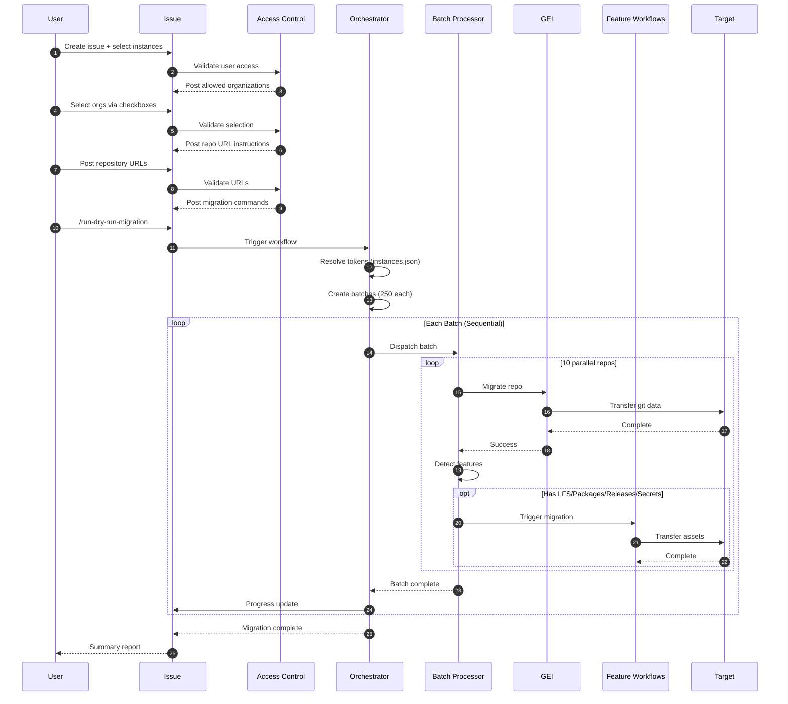

# 🚀 GitHub Enterprise Migration System

> **GitHub Actions Orchestration Framework for GEI-Based Repository Migrations**

[](https://github.com)
[](https://docs.github.com/en/migrations/using-github-enterprise-importer)
[](https://github.com)

An enterprise-grade automation framework for GitHub repository migrations using GEI (GitHub Enterprise Importer). Designed for large-scale migrations with intelligent batching, parallel processing, and comprehensive asset transfer. Supports flexible source/target configurations including GHES-to-GHEC, GHEC-to-GHEC, and EMU migrations with built-in access control, dry-run validation, and production locking capabilities.

**Key Capabilities:**
- 🎯 **Multi-Instance Support**: Configure multiple GitHub Enterprise Server and Cloud instances
- 🔐 **Fine-Grained Access Control**: Per-organization user permissions via `instances.json`
- 📦 **Smart Batching**: Automatically splits migrations into 250-repo batches (configurable)
- ⚡ **Parallel Processing**: Up to 10 concurrent repository migrations per batch
- 🔄 **Sequential Batch Execution**: Reliable batch-by-batch processing with progress tracking
- 💾 **Complete Asset Migration**: Git history, LFS, releases, packages, secrets, variables, environments
- 🧪 **Safe Testing**: Dry-run mode for validation before production
- 🔒 **Production Mode**: Automatic source repository locking during migration

## ✨ Key Features

| Feature | Description |
|---------|------------|
| 🏢 **Multi-Instance Architecture** | Support for multiple GHES and GHEC instances with centralized configuration |
| 🔐 **Role-Based Access Control** | Fine-grained permissions per organization via `instances.json` |
| 📋 **Issue-Driven Workflow** | Four-step guided process from instance selection to migration execution |
| 📦 **Smart Batching** | Automatically splits large migrations into 250-repo chunks (configurable to 256 max) |
| 🔄 **Sequential Processing** | Reliable batch-by-batch execution with comprehensive progress tracking |
| ⚡ **Parallel Execution** | Up to 10 concurrent repository migrations per batch (GEI limit) |
| 🧪 **Dry-Run Support** | Test migrations safely before production without locking sources |
| 🔒 **Production Mode** | Secure migration with automatic source repository locking |
| 💾 **Complete Data Transfer** | Git history, LFS, packages, releases, secrets, variables, and environments |
| 💬 **Real-Time Updates** | Progress notifications via GitHub issue comments |
| 🛑 **Cancellation Support** | Stop migrations gracefully with `/cancel-migration` command |
| 👥 **User Mapping** | Automatic mannequin-to-user account mapping with CSV support |
| 🧹 **Cleanup Tools** | Commands for dry-run cleanup and repository deletion |

## 🎯 Quick Start

### 📋 Prerequisites

**Required:**
- ✅ GitHub Enterprise Cloud organization (target)
- ✅ Admin access to source and target instances
- ✅ Personal Access Tokens (PATs) for each instance
- ✅ Self-hosted GitHub Actions runners (see [Runner Setup](#-actions-runner-setup) below)
- ✅ Storage backend (Azure Blob or AWS S3) for GEI

**Optional but Recommended:**
- 📁 Local cache directory (`/opt/migration`) for feature detection
- 🗺️ User mappings CSV for mannequin reclamation
- 📋 LFS/packages/releases CSV files for asset tracking

### 🔧 Initial Setup

#### 1️⃣ **Fork & Configure Repository**

```bash
# Fork this repository to your organization
# Clone to your local machine
git clone https://github.com/YOUR-ORG/migraction.git
cd migraction
```

#### 2️⃣ **Configure Instance Mapping** (`instances.json`)

This is the **most critical configuration file** - it defines your GitHub instances, organizations, and access control.

**Location:** `.github/scripts/config/instances.json`

**Structure:**
```json
{
  "sources": {
    "GHES": {
      "hostname": "ghes-prod.company.com",
      "tokenSecret": "GHES_PROD_TOKEN",
      "orgs": {
        "engineering": {
          "allowedUsers": ["alice", "bob", "migration-team"]
        },
        "platform": {
          "allowedUsers": ["alice", "migration-team"]
        }
      }
    },
    "GHEC": {
      "hostname": "github.com",
      "tokenSecret": "GHEC_CLOUD_TOKEN",
      "orgs": {
        "old-company-org": {
          "allowedUsers": ["alice", "charlie", "migration-team"]
        }
      }
    }
  },
  "targets": {
    "GHEC EMU": {
      "hostname": "github.com",
      "tokenSecret": "GHEC_EMU_TOKEN",
      "orgs": {
        "new-company-emu": {
          "allowedUsers": ["alice", "bob", "charlie", "migration-team"]
        }
      }
    }
  }
}
```

**Configuration Fields:**

| Field | Description | Example |
|-------|-------------|---------|
| `hostname` | GitHub instance hostname | `github.com` or `ghes.company.com` |
| `tokenSecret` | Name of the GitHub secret containing the PAT | `GHES_PROD_TOKEN` |
| `orgs` | Organizations on this instance | `{"engineering": {...}}` |
| `allowedUsers` | GitHub usernames permitted to migrate this org | `["alice", "bob"]` |

**Key Points:**
- 🔑 Each instance needs a unique token secret name
- 👥 Users only see organizations they're authorized for
- 🏢 You can define multiple GHES instances (e.g., `GHES-PROD`, `GHES-DEV`)
- 🎯 You can define multiple GHEC target instances
- ⚠️ The instance keys (e.g., `"GHES"`, `"GHEC EMU"`) appear in issue dropdowns

**Validation:**
```bash
# Validate your instances.json configuration
node .github/scripts/config/validate-config.js
```

#### 3️⃣ **Configure GitHub Secrets** 🔐

Navigate to **Settings** → **Secrets and variables** → **Actions** → **Secrets**

**Required Secrets:**

| Secret Name | Description | Scopes Required | Where Used |
|-------------|-------------|-----------------|------------|
| Token secrets from `instances.json` | PATs for each configured instance | `repo`, `admin:org`, `workflow` | All workflows |
| `TARGET_ADMIN_TOKEN` | Admin PAT for creating issues/comments | `repo`, `issues:write` | Reporting workflows |
| `SOURCE_ADMIN_TOKEN` | Source PAT for feature detection | `repo`, `admin:org` | Feature migration |

**Storage Backend (choose one):**

| Secret | Description | Required For |
|--------|-------------|--------------|
| `AZURE_STORAGE_CONNECTION_STRING` | Azure connection string | Azure Blob backend |
| `AWS_ACCESS_KEY_ID` | AWS access key | AWS S3 backend |
| `AWS_SECRET_ACCESS_KEY` | AWS secret key | AWS S3 backend |

**Example Token Configuration:**

If your `instances.json` has:
- `"tokenSecret": "GHES_PROD_TOKEN"` → Create secret named `GHES_PROD_TOKEN`
- `"tokenSecret": "GHEC_EMU_TOKEN"` → Create secret named `GHEC_EMU_TOKEN`
- `"tokenSecret": "GHEC_CLOUD_TOKEN"` → Create secret named `GHEC_CLOUD_TOKEN`

**PAT Scopes:**
```
repo                   # Full control of repositories
admin:org              # Full control of orgs and teams
workflow               # Update GitHub Actions workflows
```

#### 4️⃣ **Configure GitHub Variables** ⚙️

Navigate to **Settings** → **Secrets and variables** → **Actions** → **Variables**

| Variable | Description | Example | Required |
|----------|-------------|---------|----------|
| `LOCAL_CACHE_DIR` | Local cache directory for feature detection | `/opt/migration` | ⚙️ Optional (defaults to `/opt/migration`) |
| `INSTALL_PREREQS` | Auto-install GEI on runners | `true` | ✅ Yes |
| `AWS_REGION` | AWS region (if using S3) | `us-east-1` | ⚙️ Optional |
| `AWS_BUCKET_NAME` | S3 bucket name (if using S3) | `gh-migrations` | ⚙️ Optional |

**Note on `LOCAL_CACHE_DIR`:**
- Used by batch processors and feature migration workflows
- Must be accessible by self-hosted runners
- Used for detecting LFS, packages, releases, and environments
- If using multiple machines, each needs its own local cache

<details>
<summary>📦 For repositories with special requirements</summary>

Create these CSV files in your repository root:

**`lfs.csv`** - Repositories requiring LFS migration
```csv
repository
repo-with-lfs
another-lfs-repo
```

**`packages.csv`** - Repositories with packages
```csv
repository
repo-with-packages
```

**`user-mappings-gei.csv`** - Map mannequins to real users
```csv
source,target
old-username,new-username
```

**Note**: LFS/packages/releases migrations are scaffolded but need uncommenting in workflow files for production use.
#### 5️⃣ **Optional: Prepare Support Files** 📁

<details>
<summary>📦 For repositories with special requirements</summary>

Create these CSV files in your repository root if needed:

**`lfs.csv`** - Repositories requiring LFS migration
```csv
Repository,GitAttributesPaths,CloneURL
repo-with-lfs,.gitattributes,https://github.com/org/repo-with-lfs.git
another-lfs-repo,.gitattributes,https://github.com/org/another-lfs-repo.git
```

**`user-mappings-gei.csv`** - Map mannequins to real users
```csv
source,target
old-username,new-username
former-employee,current-employee
```

**Notes:**
- LFS, packages, releases, and environments are automatically detected during migration
- These CSV files are for reference and validation purposes
- User mappings are applied automatically if the file exists

</details>

## 🚀 Running Your Migration

This system uses a **4-step guided workflow** that ensures security and proper configuration:

### Step 1️⃣: Create Migration Issue 📝

1. Go to **Issues** → **New Issue**
2. Select **"🚀 Migrate Repositories to GitHub Enterprise Cloud"** template
3. **Fill out the form:**
   - **Source Instance**: Select where you're migrating FROM (e.g., `GHES`, `GHEC`)
   - **Target Instance**: Select where you're migrating TO (e.g., `GHEC EMU`)
   - **Target Repository Visibility**: Choose `Private`, `Internal`, or `Mirror`
   - **Migration Priority**: Set urgency level (optional)
   - **Migration Requirements**: Check boxes for what needs to be migrated
4. **Submit the issue**

**What happens next:**
- The system validates your access to the selected instances
- If you have access, it posts a comment with organizations you can use

### Step 2️⃣: Select Organizations 🏢

After creating the issue, you'll receive an automated comment like:

```markdown
## ✅ Step 2: Select Organizations

You have access to the following organizations:

### 🏠 Source Organizations (GHES)
- [ ] engineering
- [ ] platform

### 🎯 Target Organizations (GHEC EMU)
- [ ] new-company-emu

**Instructions:**
1. Edit this comment (click the three dots → Edit)
2. Check ONE box from source organizations
3. Check ONE box from target organizations
4. Save the comment
```

**Action Required:**
1. Click the **three dots** (•••) on the automated comment
2. Select **Edit**
3. Check **ONE** checkbox for source org
4. Check **ONE** checkbox for target org
5. **Save** the comment

**What happens next:**
- The system validates your selections
- It posts Step 3 with instructions for providing repository URLs

### Step 3️⃣: Provide Repository URLs 📋

After selecting organizations, you'll receive:

```markdown
## ✅ Step 3: Provide Repository URLs

Add a comment with the repositories you want to migrate.

**Format:**
https://ghes-prod.company.com/engineering/repo1
https://ghes-prod.company.com/engineering/repo2
https://ghes-prod.company.com/engineering/repo3

**Requirements:**
- One URL per line
- Must be from: ghes-prod.company.com/engineering/
```

**Action Required:**
1. Create a **new comment** on the issue
2. List repository URLs (one per line)
3. Post the comment

**What happens next:**
- The system validates all URLs match the selected source org
- It posts Step 4 with migration commands

### Step 4️⃣: Execute Migration 🎬

After posting URLs, you'll receive:

```markdown
## ✅ Step 4: Ready to Migrate!

✅ Detected: 125 repositories
📦 Batches: 1 (250 repos per batch)
🎯 Target: new-company-emu

**Test first (recommended):**
/run-dry-run-migration

**Production migration:**
/run-production-migration
```

**Action Required:**
Add a comment with one of these commands:

#### 🧪 **Test First (Recommended)**
```
/run-dry-run-migration
```
- ✅ Safe, non-destructive test
- ✅ Creates test repositories (GEI handles naming with suffixes)
- ✅ Source repositories remain unlocked and unchanged
- ✅ Verify process before production

#### 🚀 **Production Migration**
```
/run-production-migration
```
- ⚠️ **Locks source repositories** (prevents changes during migration)
- ✅ Creates production repositories with correct names
- ✅ Run only after successful dry-run validation

### Step 5️⃣: Monitor Progress 📊

Watch real-time updates in your issue comments:

```
🚀 Migration Started

📊 Configuration:
├─ Mode: dry-run
├─ Total Repositories: 625
├─ Batches: 3 (250 repos per batch)
├─ Parallel per batch: 10
└─ Target: new-company-emu

---

🚀 Batch 1 of 3 Starting
📦 Repositories: 250
🔄 Processing with 10 parallel workers
➡️ Track progress: Actions tab → Batch 1 workflow

✅ Batch 1 of 3 Complete
🎉 Status: SUCCESS
⏱️ Duration: 42 minutes
� Results: 250 succeeded, 0 failed

---

🚀 Batch 2 of 3 Starting...
```

**Monitoring Tips:**
- 📋 High-level progress: Issue comments
- 🔍 Detailed logs: **Actions** tab → Select workflow run
- 📊 Individual repo status: Workflow job logs
- ⏱️ Estimated time: ~1 minute per repo (varies by size)

### Post-Migration Tasks 🎉

After successful migration:

**Verification:**
- � Review the final summary report in the issue
- ✅ Verify all repositories migrated successfully
- � Update placeholder secrets (security requirement)
- 👥 Configure team access in target organization
- 🔧 Update CI/CD configurations if needed

**Cleanup Commands:**

```markdown
# Remove dry-run test repositories
/delete-dry-run

# Remove specific repositories (use with caution!)
/delete-repositories

# Cancel ongoing migration
/cancel-migration
```

## 🖥️ Actions Runner Setup

**CRITICAL**: This system requires self-hosted GitHub Actions runners for batch processing. GitHub-hosted runners are only used for orchestration.

### **Runner Architecture Overview**

The migration system uses a three-tier runner architecture:

```
┌─────────────────────────────────────────────────────┐
│  Tier 1: Orchestration (GitHub-hosted)             │
│  ├─ Creates batches                                 │
│  ├─ Dispatches workflows                            │
│  └─ Posts progress updates                          │
└─────────────────────────────────────────────────────┘
                        ↓
┌─────────────────────────────────────────────────────┐
│  Tier 2: Batch Processing (Self-hosted)            │
│  ├─ Runs GEI migrations (10 parallel)               │
│  ├─ Detects features (LFS, packages, etc.)          │
│  └─ Triggers feature migrations                     │
└─────────────────────────────────────────────────────┘
                        ↓
┌─────────────────────────────────────────────────────┐
│  Tier 3: Feature Migrations (Self-hosted)          │
│  ├─ LFS data transfer                               │
│  ├─ Packages migration                              │
│  ├─ Releases migration                              │
│  ├─ Secrets/Variables migration                     │
│  └─ Environments migration                          │
└─────────────────────────────────────────────────────┘
```

### **Required Runners**

| Workflow | Runner Type | Label | Quantity | Purpose |
|----------|-------------|-------|----------|---------|
| **Orchestrator** | GitHub-hosted | `ubuntu-latest` | N/A | Batch creation, sequencing |
| **Batch Processor** | **Self-hosted** | `self-hosted` | **1-10** | GEI repository migrations |
| **LFS Migration** | **Self-hosted** | `self-hosted` | 0-10+ | LFS data transfer (optional) |
| **Packages Migration** | **Self-hosted** | `self-hosted` | 0-10+ | Package migration (optional) |
| **Releases Migration** | **Self-hosted** | `self-hosted` | 0-10+ | Release migration (optional) |
| **Environments** | **Self-hosted** | `self-hosted` | 0-10+ | Environment migration (optional) |
| **Variables/Secrets** | **Self-hosted** | `self-hosted` | 0-10+ | Secrets/vars migration (optional) |

### **Minimum Runner Requirements**

**Scenario 1: Minimal Setup (Sequential Processing)**
```
1 self-hosted runner (labeled: self-hosted)
└─ Handles all batch processing and feature migrations sequentially
└─ Slowest option but requires minimal infrastructure
```

**Scenario 2: Standard Setup (Recommended)**
```
10 self-hosted runners (labeled: self-hosted)
├─ All 10 handle batch processing (10 repos migrate in parallel)
└─ Same runners handle feature migrations when needed
└─ Best balance of speed and infrastructure
```

**Scenario 3: High-Performance Setup**
```
20+ self-hosted runners (labeled: self-hosted)
├─ 10 runners dedicated to batch processing
└─ 10+ runners dedicated to feature migrations (LFS, packages, etc.)
└─ Maximum throughput for large-scale migrations
```

### **Physical Deployment Options**

**Important**: Multiple runner processes can run on the same physical machine. You do NOT need separate hardware for each runner.

#### **Option A: Single Machine (Most Common)**

One powerful server running all runner processes:

```
Server: gh-migration-01
├─ CPU: 32+ cores
├─ RAM: 64+ GB
├─ Disk: 1TB+ SSD
├─ Runners: 10-20 processes
│   ├─ Each registered with label: self-hosted
│   ├─ Each running as separate process
│   └─ All sharing system resources
└─ Local cache: /opt/migration (shared by all)
```

**Recommended specs for 10 concurrent runners:**
- **CPU**: 16-32 cores (2 cores per runner minimum)
- **Memory**: 32-64 GB RAM (3-4GB per runner minimum)
- **Disk**: Fast SSD with 500GB-1TB space for `/opt/migration`
- **Network**: High bandwidth for GitHub API and LFS transfers

#### **Option B: Distributed Deployment**

Multiple machines for load distribution:

```
Machine A: Batch Processing
├─ 10 runner processes (labeled: self-hosted)
├─ Specs: 32 cores, 64GB RAM, 500GB SSD
└─ Handles: GEI migrations

Machine B: Feature Migrations
├─ 10 runner processes (labeled: self-hosted)
├─ Specs: 16 cores, 32GB RAM, 1TB SSD
└─ Handles: LFS, packages, releases, environments

Each machine has its own /opt/migration local cache
```

### **Runner Installation**

**For each self-hosted runner instance:**

1. **Download Runner** (on your server):
```bash
# Create a directory for the runner
mkdir -p ~/actions-runner-1 && cd ~/actions-runner-1

# Download the latest runner package
curl -o actions-runner-linux-x64-2.311.0.tar.gz -L \
  https://github.com/actions/runner/releases/download/v2.311.0/actions-runner-linux-x64-2.311.0.tar.gz

# Extract
tar xzf ./actions-runner-linux-x64-2.311.0.tar.gz
```

2. **Configure Runner**:
```bash
# Go to: https://github.com/YOUR-ORG/migraction/settings/actions/runners/new
# Copy the token from the page, then run:

./config.sh --url https://github.com/YOUR-ORG/migraction \
  --token YOUR-REGISTRATION-TOKEN \
  --name gh-migration-runner-1 \
  --labels self-hosted,Linux,X64 \
  --work _work
```

3. **Install as Service** (recommended):
```bash
# Install service
sudo ./svc.sh install

# Start service
sudo ./svc.sh start

# Check status
sudo ./svc.sh status
```

4. **Repeat for Additional Runners**:
```bash
# For runner 2, 3, etc. on the same machine:
mkdir -p ~/actions-runner-2 && cd ~/actions-runner-2
# ... repeat steps with unique names (gh-migration-runner-2, etc.)
```

### **Runner Configuration Requirements**

**System Dependencies** (installed automatically if `INSTALL_PREREQS=true`):
```bash
# Ubuntu/Debian
sudo apt-get update && sudo apt-get install -y \
  git \
  unzip \
  curl \
  wget \
  apt-transport-https \
  software-properties-common \
  jq

# GEI CLI (installed automatically on first run)
wget https://github.com/github/gh-gei/releases/latest/download/gei-linux-amd64
sudo install gei-linux-amd64 /usr/local/bin/gei
```

**Local Cache Directory**:
```bash
# Create and set permissions for cache directory
sudo mkdir -p /opt/migration
sudo chown -R $(whoami):$(whoami) /opt/migration
sudo chmod -R 755 /opt/migration
```

**Permissions**:
- Runner processes must have read/write access to `LOCAL_CACHE_DIR` (default: `/opt/migration`)
- Runner service account needs permission to install packages if `INSTALL_PREREQS=true`

### **Runner Verification**

After setting up runners, verify they're online:

1. Go to: `https://github.com/YOUR-ORG/migraction/settings/actions/runners`
2. Check that all runners show **"Idle"** status (green dot)
3. Verify the **Labels** include: `self-hosted`, `Linux`, `X64`

**Test your runner setup:**
```bash
# Create a test workflow dispatch in your repository
# or run a test migration with 1-2 repositories
```

### **Scaling Recommendations**

| Migration Size | Runners Needed | Physical Machines | Expected Duration |
|----------------|----------------|-------------------|-------------------|
| < 100 repos | 1-5 runners | 1 machine | Hours |
| 100-500 repos | 5-10 runners | 1 machine | 1-2 days |
| 500-2000 repos | 10 runners | 1-2 machines | 3-7 days |
| 2000-5000 repos | 10-20 runners | 2-3 machines | 1-3 weeks |
| 5000+ repos | 20+ runners | 3-5 machines | 3-6 weeks |

**Performance Notes:**
- Each repository takes approximately 1-5 minutes (varies by size)
- LFS repositories take significantly longer (depends on data size)
- 10 parallel migrations is the GEI maximum (hard limit)
- Adding more than 10 batch runners doesn't increase parallel GEI migrations
- Additional runners help with feature migrations (LFS, packages, etc.)

## 💾 Storage & Caching

### **1. GEI Storage Backend (Required)**

GEI requires a cloud storage backend for temporary data during repository migrations. This is **separate** from the local cache.

**Purpose**: GEI uses this for:
- Storing git archive during migration
- Intermediate migration artifacts
- Metadata exchange between source and target

**Configuration Options:**

| Backend | Required Secrets | Required Variables | When to Use |
|---------|------------------|-------------------|-------------|
| **Azure Blob** | `AZURE_STORAGE_CONNECTION_STRING` | None | Azure-hosted infrastructure |
| **AWS S3** | `AWS_ACCESS_KEY_ID`<br>`AWS_SECRET_ACCESS_KEY` | `AWS_REGION`<br>`AWS_BUCKET_NAME` | AWS-hosted infrastructure |

**Setup Instructions:**

**For Azure Blob Storage:**
```bash
# 1. Create storage account in Azure Portal
# 2. Get connection string from: Storage Account → Access Keys
# 3. Add to GitHub Secrets as: AZURE_STORAGE_CONNECTION_STRING
```

**For AWS S3:**
```bash
# 1. Create S3 bucket in AWS Console
# 2. Create IAM user with S3 access
# 3. Add secrets: AWS_ACCESS_KEY_ID, AWS_SECRET_ACCESS_KEY
# 4. Add variables: AWS_REGION, AWS_BUCKET_NAME
```

### **2. Local Cache Directory (Optional but Recommended)**

**Location**: `/opt/migration` (default, configurable via `LOCAL_CACHE_DIR` variable)

**Purpose**: Used for detecting and caching migration features:
- 📦 Packages metadata (CSV exports)
- 📋 Releases data
- 🗂️ Environment configurations
- 🔍 Repository feature detection

**Who Needs Access:**

| Workflow | Needs Cache? | Purpose |
|----------|--------------|---------|
| Orchestrator | ❌ No | Only creates batches and dispatches |
| Batch Processor | ✅ **Yes** | Detects features (LFS, packages, releases, environments) |
| LFS Migration | ✅ **Yes** | Reads/writes LFS export data |
| Packages Migration | ✅ **Yes** | Reads package CSV exports |
| Releases Migration | ✅ **Yes** | Reads/writes release data |
| Environments | ✅ **Yes** | Reads environment CSV |
| Variables/Secrets | ❌ No | Fetches directly from source API |

**Deployment Scenarios:**

**Single Machine:**
```bash
# All runners automatically share local /opt/migration
sudo mkdir -p /opt/migration
sudo chown -R runner-user:runner-user /opt/migration
sudo chmod -R 755 /opt/migration

# No additional configuration needed
```

**Multiple Machines:**
```bash
# Each machine running batch/feature workflows needs its own cache
# Machine A (batch processors):
sudo mkdir -p /opt/migration

# Machine B (feature migrations):
sudo mkdir -p /opt/migration

# No network storage needed - each machine uses local disk
```

**Storage Requirements:**
- **Minimal**: 50-100 GB for small migrations
- **Standard**: 500GB - 1TB for medium migrations
- **Large**: 1TB+ for enterprise migrations with significant LFS/packages

### **3. Pre-Migration Cache Preparation (Optional)**

**Purpose**: Pre-populate the local cache BEFORE running migrations to optimize performance.

**Benefits:**
- ⚡ Faster migration execution (data already local)
- 🔄 Reduced API calls during migration
- 📊 Better parallelization (no export bottleneck)
- 🎯 Validate data before migration

**Available Pre-Migration Tools:**

Each tool exports data to `LOCAL_CACHE_DIR` that the migration workflows can use:

| Tool | Purpose | Documentation |
|------|---------|---------------|
| **[gh-migrate-releases](https://github.com/mona-actions/gh-migrate-releases)** | Export releases to local cache | Full docs in repo |
| **[gh-migrate-lfs](https://github.com/mona-actions/gh-migrate-lfs)** | Export LFS objects | Full docs in repo |
| **[gh-migrate-packages](https://github.com/mona-actions/gh-migrate-packages)** | Export package metadata | Full docs in repo |
| **[gh-migrate-environments](https://github.com/mona-actions/gh-migrate-environments)** | Export environments | Full docs in repo |

**Example Usage:**
```bash
# 1. Install the tool
gh extension install mona-actions/gh-migrate-releases

# 2. Export to cache directory
gh migrate-releases export \
  --source-org old-company \
  --cache-dir /opt/migration \
  --token $SOURCE_TOKEN

# 3. Run migration workflow
# It will automatically detect and use cached data
```

**Note**: The migration workflows will automatically export if data is not pre-cached, but pre-caching can significantly improve performance for large-scale migrations (1000+ repos).

### **Storage Architecture Diagram**

```
┌─────────────────────────────────────────────────────┐
│  GEI Storage Backend (Cloud)                        │
│  ├─ Azure Blob Storage OR AWS S3                    │
│  ├─ Temporary git archives                          │
│  └─ GEI migration artifacts                         │
└─────────────────────────────────────────────────────┘
                        ↕
┌─────────────────────────────────────────────────────┐
│  Self-Hosted Runners                                │
│  ├─ Batch Processors                                │
│  │  └─ Uses: GEI storage + Local cache              │
│  └─ Feature Migrations                              │
│     └─ Uses: Local cache only                       │
└─────────────────────────────────────────────────────┘
                        ↕
┌─────────────────────────────────────────────────────┐
│  Local Cache Directory (/opt/migration)             │
│  ├─ packages/export/*.csv                           │
│  ├─ releases/<org>/<repo>/                          │
│  ├─ <org>_environments.csv                          │
│  └─ lfs detection results                           │
└─────────────────────────────────────────────────────┘
```

## 🎛️ Advanced Configuration

### ⚙️ Batch Size Configuration

Control how many repositories are processed per batch:

**Location**: `.github/workflows/trigger.yml`

```yaml
with:
  BATCH_SIZE: 250  # Default: 250, Max: 256 (GitHub Actions matrix limit)
```

**Considerations:**
- Larger batches = fewer sequential batch executions
- Maximum is 256 (GitHub Actions matrix size limit)
- Batch size doesn't affect parallelism (always max 10 concurrent per batch)

### 🔄 Parallel Processing Configuration

Control concurrent migrations per batch:

**Location**: `.github/workflows/batch-processor.yml`

```yaml
strategy:
  max-parallel: 10  # GEI hard limit, do not exceed
```

**Important**: 
- ⚠️ **Do not exceed 10** - this is a GEI CLI limitation
- Each parallel job migrates one repository
- With 10 runners + max-parallel: 10, you get full parallelization

### ⏱️ Timeout Configuration

For large repositories or slow networks:

**Location**: `.github/workflows/batch-processor.yml`

```yaml
timeout-minutes: 50400  # 35 days (GitHub Actions maximum)
```

**Guidelines:**
- Default: 50400 minutes (35 days)
- Adjust based on largest repository size
- Includes time for LFS transfers and feature migrations

### 🌐 Multi-Instance Configuration

Add additional GitHub instances to `instances.json`:

```json
{
  "sources": {
    "GHES-PROD": {
      "hostname": "ghes-prod.company.com",
      "tokenSecret": "GHES_PROD_TOKEN",
      "orgs": {...}
    },
    "GHES-DEV": {
      "hostname": "ghes-dev.company.com",
      "tokenSecret": "GHES_DEV_TOKEN",
      "orgs": {...}
    },
    "GHEC-ORG1": {
      "hostname": "github.com",
      "tokenSecret": "GHEC_ORG1_TOKEN",
      "orgs": {...}
    }
  },
  "targets": {
    "GHEC-EMU-PROD": {...},
    "GHEC-EMU-TEST": {...}
  }
}
```

**Then update the issue template** (`.github/ISSUE_TEMPLATE/gei-batch-migrations.yml`):

```yaml
- type: dropdown
  id: source-instance
  attributes:
    label: 🏠 Source Instance
    options:
      - "GHES-PROD"
      - "GHES-DEV"
      - "GHEC-ORG1"
```

### 🔐 Variables & Secrets Migration

**Fully automated** - no configuration needed!

**How it works:**
1. ✅ Batch processor detects repository variables and secrets
2. ✅ Triggers variables-secrets.yml workflow automatically
3. ✅ Migrates variables with actual values
4. ⚠️ Creates placeholder secrets (security requirement)

**Post-migration:**
- Review placeholder secrets: `https://github.com/TARGET_ORG/REPO/settings/secrets/actions`
- Update with actual values manually
- Verify variables migrated correctly

**Security Note**: GitHub API doesn't allow reading secret values, only names. Placeholders must be manually updated.

### 🌍 Environments Migration

**Fully automated** - environments are detected and migrated automatically!

**What's Migrated:**
- ✅ Environment names and settings
- ✅ Protection rules (wait timers, required reviewers)
- ✅ Deployment branch policies
- ✅ Custom protection rules
- ⚠️ Environment secrets (as placeholders, like repo secrets)

**Prerequisites:**
- Target repositories must exist (✅ done via main migration)
- Environments CSV must be in cache (✅ auto-generated or pre-cached)

**Verification:**
Check migrated environments at: `https://github.com/TARGET_ORG/REPO/settings/environments`

### 📦 Feature-Specific Configuration

**LFS Migration:**
- Detected automatically via `.gitattributes` file
- Optional: Pre-populate `lfs.csv` for tracking
- Uses `gh-migrate-lfs` tool

**Packages Migration:**
- Detected from cached package exports
- Requires `LOCAL_CACHE_DIR` with package CSV files
- Supports: npm, Maven, NuGet, Docker, RubyGems

**Releases Migration:**
- Detected from cached release data in `LOCAL_CACHE_DIR`
- Migrates: Release notes, assets, tags
- Preserves: Draft status, prerelease flags

### 🎨 Customizing Visibility Logic

**Default behavior**: Set via issue template dropdown

**Advanced**: Modify `batch-processor.yml` for custom logic:

```yaml
env:
  VISIBILITY: ${{ github.event.client_payload.batch.targetRepositoryVisibility }}
```

**Options**:
- `Private` - All migrated repos are private
- `Internal` - All repos are internal (requires EMU or GHEC)
- `Mirror` - Preserves source visibility (custom implementation required)

## 🛠️ Troubleshooting

### 🚨 Common Issues & Solutions

<details>
<summary>🔴 <strong>Migration Won't Start</strong></summary>

**Symptoms:**
- No response after posting migration command
- Workflows don't trigger

**Checklist:**
1. ✅ Verify you completed all 4 steps of the guided workflow
2. ✅ Check PAT permissions (must include `repo`, `admin:org`, `workflow`)
3. ✅ Ensure secrets names match `instances.json` tokenSecret values
4. ✅ Confirm issue has `migration` and `batch` labels
5. ✅ Verify at least 1 self-hosted runner is online
6. ✅ Check Actions tab for workflow errors

**Debug Commands:**
```bash
# Verify secrets are configured
gh secret list --repo YOUR-ORG/migraction

# Check runner status
# Go to: https://github.com/YOUR-ORG/migraction/settings/actions/runners
```

</details>

<details>
<summary>🟡 <strong>Batch Processing Stops or Times Out</strong></summary>

**Symptoms:**
- Batch workflow starts but doesn't complete
- "Job was cancelled" errors

**Steps:**
1. Check **Actions tab** → Select failed workflow → Review logs
2. Verify runner availability:
   - Go to Settings → Actions → Runners
   - Ensure runners show "Idle" (green) not "Offline" (gray)
3. Check runner logs on the server:
   ```bash
   # View runner logs
   cat ~/actions-runner-1/_diag/Runner_*.log
   ```
4. Verify GEI CLI is installed:
   ```bash
   gei --version
   # If not found, set INSTALL_PREREQS=true
   ```
5. Check API rate limits:
   ```bash
   gh api rate_limit --token $YOUR_TOKEN
   ```
6. Re-run failed batch from Actions tab

</details>

<details>
<summary>🔵 <strong>Features Not Migrating (LFS/Packages/Releases)</strong></summary>

**Symptoms:**
- Main migration succeeds but features missing
- No LFS objects, packages, or releases in target

**Diagnosis:**

1. **Check if features were detected:**
   - Go to Actions → Batch workflow logs
   - Look for "Detect features requiring additional migration steps"
   - Check output: `lfs=true`, `packages=true`, `releases=true`

2. **Verify LOCAL_CACHE_DIR:**
   ```bash
   # On runner machine
   ls -la /opt/migration/
   # Should contain: packages/, releases/, *_environments.csv
   ```

3. **Check feature workflow triggering:**
   - Go to Actions → Filter by workflow (lfs.yml, packages.yml, etc.)
   - Verify workflows were dispatched

4. **Pre-cache data** (recommended for large migrations):
   ```bash
   # Use gh-migrate-* tools to pre-populate cache
   gh extension install mona-actions/gh-migrate-releases
   gh migrate-releases export --source-org ORG --cache-dir /opt/migration
   ```

</details>

<details>
<summary>🟠 <strong>Access Denied or Authorization Errors</strong></summary>

**Symptoms:**
- "User does not have access" message
- Organization checkboxes don't appear
- "Unknown source instance" errors

**Resolution:**

1. **Verify user is in allowedUsers:**
   ```json
   // Check .github/scripts/config/instances.json
   {
     "sources": {
       "GHES": {
         "orgs": {
           "engineering": {
             "allowedUsers": ["YOUR-USERNAME", "..."]
           }
         }
       }
     }
   }
   ```

2. **Validate instances.json:**
   ```bash
   node .github/scripts/config/validate-config.js
   ```

3. **Check secret names match:**
   - Instance config: `"tokenSecret": "GHES_PROD_TOKEN"`
   - GitHub Secret: Must be named exactly `GHES_PROD_TOKEN`

</details>

<details>
<summary>🟣 <strong>Secrets/Variables Not Migrating Correctly</strong></summary>

**Expected Behavior:**
- ✅ Variables: Migrate with actual values
- ⚠️ Secrets: Migrate as placeholders (security limitation)

**Why?**
GitHub API doesn't allow reading secret values, only names. This is by design for security.

**Post-Migration Actions:**
1. Go to target repo: `https://github.com/TARGET_ORG/REPO/settings/secrets/actions`
2. Update each placeholder secret with actual value
3. Verify variables at: `https://github.com/TARGET_ORG/REPO/settings/variables/actions`

</details>

<details>
<summary>⚫ <strong>Runner Out of Disk Space</strong></summary>

**Symptoms:**
- "No space left on device" errors
- LFS migrations fail
- Workflows crash unexpectedly

**Resolution:**

1. **Check disk usage:**
   ```bash
   df -h /opt/migration
   du -sh /opt/migration/*
   ```

2. **Clean up old migrations:**
   ```bash
   # Remove old cache data
   sudo rm -rf /opt/migration/old-migration-*
   
   # Clean up GEI archives
   sudo find /opt/migration -name "*.tar.gz" -mtime +7 -delete
   ```

3. **Increase disk space** or move cache:
   ```bash
   # Option 1: Mount larger volume to /opt/migration
   
   # Option 2: Change LOCAL_CACHE_DIR variable to new location
   # Settings → Variables → LOCAL_CACHE_DIR → /mnt/large-disk/migration
   ```

4. **Stagger migrations:** Run smaller batches to reduce concurrent disk usage

</details>

### 🛑 Emergency Controls

**Stop an ongoing migration:**
```
/cancel-migration
```
Posts comment to issue, workflows must be manually cancelled in Actions tab.

**Clean up dry-run repositories:**
```
/delete-dry-run
```
⚠️ Use carefully - permanently deletes all repositories with dry-run naming patterns.

**Delete specific repositories:**
```
/delete-repositories
```
⚠️ DANGEROUS - Requires confirmation, permanently deletes repositories.

**Re-run a specific failed batch:**
1. Go to **Actions** tab
2. Find the failed batch workflow (e.g., "Migration Batch 3")
3. Click **"Re-run failed jobs"** or **"Re-run all jobs"**
4. Monitor progress in issue comments

### 📋 Debugging Checklist

Before opening a support issue, collect:

```markdown
**Environment:**
- [ ] Number of repositories: ___
- [ ] Source instance: GHES / GHEC / Other
- [ ] Target instance: GHEC / GHEC EMU
- [ ] Number of self-hosted runners: ___
- [ ] Runner OS: Linux / Windows / macOS

**Configuration:**
- [ ] INSTALL_PREREQS value: ___
- [ ] BATCH_SIZE: ___
- [ ] max-parallel: ___
- [ ] Storage backend: Azure / AWS

**Issue Details:**
- [ ] Workflow run URL: ___
- [ ] Error messages: ___
- [ ] Issue number: #___
- [ ] Batch number (if applicable): ___

**Logs:**
- [ ] Attached workflow logs (Actions → Select run → Download logs)
- [ ] Runner logs (if available)
```

### 🔍 Advanced Debugging

**Enable verbose logging:**

Edit `.github/workflows/batch-processor.yml`:

```yaml
- name: Execute GEI migration
  run: |
    # Add --verbose flag
    gei migrate-repo \
      --verbose \
      --github-source-org $SOURCE_ORG \
      ...
```

**Test GEI manually:**
```bash
# SSH into runner machine
cd /opt/migration

# Test single repository migration
gei migrate-repo \
  --github-source-org source-org \
  --source-repo test-repo \
  --github-target-org target-org \
  --target-repo test-repo \
  --github-source-pat $SOURCE_TOKEN \
  --github-target-pat $TARGET_TOKEN
```

**Validate token permissions:**
```bash
# Test source token
gh auth status --hostname ghes.company.com

# Test target token
gh auth status

# Check org access
gh api /orgs/YOUR-ORG --hostname ghes.company.com
```

## 📊 Architecture & Workflow

### **System Architecture**

```
┌─────────────────────────────────────────────────────────────┐
│  User (Issue-Driven Interface)                              │
│  ├─ Creates issue with instance selection                   │
│  ├─ Selects source/target organizations                     │
│  ├─ Provides repository URLs                                │
│  └─ Triggers migration command                              │
└─────────────────────────────────────────────────────────────┘
                           ↓
┌─────────────────────────────────────────────────────────────┐
│  Access Control & Validation (instances.json)               │
│  ├─ Filters organizations by user permissions               │
│  ├─ Validates source/target configuration                   │
│  └─ Ensures repos match selected organization               │
└─────────────────────────────────────────────────────────────┘
                           ↓
┌─────────────────────────────────────────────────────────────┐
│  Orchestrator (GitHub-hosted: ubuntu-latest)                │
│  ├─ Resolves tokens from instances.json config              │
│  ├─ Creates batches (250 repos each)                        │
│  ├─ Dispatches batches sequentially                         │
│  └─ Posts progress updates to issue                         │
└─────────────────────────────────────────────────────────────┘
                           ↓
┌─────────────────────────────────────────────────────────────┐
│  Batch Processor (Self-hosted: 1-10 runners)                │
│  ├─ Parallel execution (max 10 concurrent)                  │
│  ├─ GEI repository migration                                │
│  ├─ Feature detection (LFS, packages, releases, etc.)       │
│  └─ Triggers feature migrations                             │
└─────────────────────────────────────────────────────────────┘
                           ↓
┌─────────────────────────────────────────────────────────────┐
│  Feature Migrations (Self-hosted: 0-10+ runners)            │
│  ├─ Variables & Secrets → variables-secrets.yml             │
│  ├─ LFS Objects → lfs.yml                                   │
│  ├─ Packages → packages.yml                                 │
│  ├─ Releases → releases.yml                                 │
│  └─ Environments → environments.yml                         │
└─────────────────────────────────────────────────────────────┘
                           ↓
┌─────────────────────────────────────────────────────────────┐
│  Reporting & Completion                                     │
│  ├─ Batch status updates                                    │
│  ├─ Feature migration report                                │
│  ├─ Final summary with statistics                           │
│  └─ Next steps and post-migration checklist                 │
└─────────────────────────────────────────────────────────────┘
```

### **Migration Flow Diagram**



### **Key Workflows**

| Workflow | Trigger | Runner Type | Purpose |
|----------|---------|-------------|---------|
| **prepare.yml** | Issue opened/edited | `ubuntu-latest` | Parse issue, validate access, post org selection |
| **on-checkbox-edit.yml** | Issue comment created/edited | `ubuntu-latest` | Detect org selection, post Step 3 |
| **parse-repos.yml** | Issue comment | `ubuntu-latest` | Parse repository URLs, post Step 4 |
| **trigger.yml** | Issue comment (`/run-*-migration`) | `ubuntu-latest` | Validate setup, trigger orchestrator |
| **orchestrator.yml** | Called by trigger.yml | `ubuntu-latest` | Create batches, dispatch sequentially |
| **batch-processor.yml** | Repository dispatch | **`self-hosted`** | Run GEI migrations (10 parallel) |
| **variables-secrets.yml** | Workflow dispatch | **`self-hosted`** | Migrate repo variables & secrets |
| **lfs.yml** | Workflow dispatch | **`self-hosted`** | Migrate LFS objects |
| **packages.yml** | Workflow dispatch | **`self-hosted`** | Migrate packages |
| **releases.yml** | Workflow dispatch | **`self-hosted`** | Migrate releases |
| **environments.yml** | Workflow dispatch | **`self-hosted`** | Migrate deployment environments |
| **delete.yml** | Issue comment (`/delete-*`) | `ubuntu-latest` | Cleanup workflows |

### **Data Flow**

```
┌──────────────────┐
│  instances.json  │ ← Configuration: instances, orgs, users, tokens
└────────┬─────────┘
         │
         ↓
┌──────────────────┐
│  GitHub Secrets  │ ← Tokens: GHES_PROD_TOKEN, GHEC_EMU_TOKEN, etc.
└────────┬─────────┘
         │
         ↓
┌──────────────────┐
│  Orchestrator    │ ← Resolves tokens, creates batches
└────────┬─────────┘
         │
         ↓
┌──────────────────┐
│  Batch Dispatch  │ ← repository_dispatch event with payload
└────────┬─────────┘
         │
         ↓
┌──────────────────┐
│ Batch Processor  │ ← Receives: repos, tokens, org names
└────────┬─────────┘
         │
         ├──→ GEI CLI ──→ Cloud Storage (Azure/S3) ──→ Target Repo
         │
         └──→ Feature Detection ──→ LOCAL_CACHE_DIR (/opt/migration)
                  │
                  └──→ Trigger Feature Workflows
```

### **Performance Metrics**

| Scale | Repositories | Batches | Est. Time | Workers |
|-------|-------------|---------|-----------|---------|
| **Small** | 1-50 | 1 | 5-50 min | 10 parallel |
| **Medium** | 51-250 | 1 | 50-250 min | 10 parallel |
| **Large** | 251-1000 | 4 | 4-17 hours | 10 parallel |
| **Enterprise** | 1001-5000 | 20 | 3-7 days | 10 parallel |
| **Massive** | 5000+ | 20+ | 1-6 weeks | 10 parallel |

**Time Calculation:**
```
Total Time = (Total Repos ÷ 10 parallel) × Avg Time per Repo
           + (Number of Batches × Batch Overhead)

Where:
- Avg Time per Repo: 1-5 minutes (varies by size)
- Batch Overhead: ~2 minutes per batch
- LFS repos: +10-60 minutes depending on data size
```

**Factors Affecting Performance:**
- 🔢 Repository size and complexity
- 💾 LFS data volume
- 📦 Number of packages
- 🌐 Network bandwidth
- 🖥️ Runner specifications
- ⚡ Whether data is pre-cached

## 🔒 Security Best Practices

### 🛡️ Token Security

**PAT Management:**
- 🔑 Store all tokens in GitHub Secrets (never in code or config files)
- 🔄 Rotate tokens after each major migration
- 📅 Set token expiration dates (recommended: 90 days)
- 🎯 Use minimum required permissions (see [Setup](#3️⃣-configure-github-secrets-))
- 👥 Create service account tokens (don't use personal tokens)

**Required Scopes:**
```
repo                   # Full control of repositories
admin:org              # Full control of orgs and teams  
workflow               # Update GitHub Actions workflows
```

**Token Storage Pattern:**
```json
// instances.json references secret names:
"tokenSecret": "GHES_PROD_TOKEN"

// Actual token stored in GitHub Secrets:
Settings → Secrets → Actions → GHES_PROD_TOKEN = "ghp_xxxxxxxxxxxx"
```

### 👥 Access Control

**Role-Based Access via instances.json:**

```json
{
  "sources": {
    "GHES": {
      "orgs": {
        "sensitive-org": {
          "allowedUsers": ["admin1", "admin2"]  // Restricted access
        },
        "general-org": {
          "allowedUsers": ["admin1", "admin2", "dev-team", "migration-team"]
        }
      }
    }
  }
}
```

**Best Practices:**
- 🔐 Limit `allowedUsers` to minimum necessary personnel
- 👥 Create dedicated migration teams
- 📋 Use groups or team names (document mapping separately)
- 🔄 Review access quarterly
- 📝 Audit who has modified instances.json (git history)

**During Migration:**
- 🚪 Restrict issue creation to authorized teams
- 🔒 Production migrations lock source repositories
- 👁️ Monitor Actions workflow runs
- 📊 Review migration logs for anomalies

### 💾 Data Handling

**In-Flight Data:**
- 🗄️ GEI uses cloud storage (Azure/S3) for temporary archives
- 🔒 Ensure storage accounts use encryption at rest
- 🌐 Use private endpoints for storage (if available)
- ⏰ Configure lifecycle policies to auto-delete old archives (30 days)

**Local Cache (`/opt/migration`):**
- 📁 Contains metadata and feature exports (not full repo data)
- 🔐 Set appropriate filesystem permissions (755)
- � Runner service account should be dedicated user
- 🧹 Clean up after successful migrations
- 📊 Regular audits of cached data

**Clean Up Commands:**
```bash
# After successful migration, clean cache:
sudo rm -rf /opt/migration/old-migration-*

# Remove GEI temporary files:
sudo find /opt/migration -name "*.tar.gz" -mtime +30 -delete

# Clean up cloud storage archives:
# Azure: Set lifecycle management rules
# AWS: Set S3 lifecycle policies
```

### 🔍 Audit & Compliance

**Logging:**
- � All migration actions logged in GitHub Actions workflows
- 💬 Issue comments provide audit trail
- 🔍 Workflow run history retained (default: 90 days)

**Compliance Considerations:**
- � Document migrations in change management system
- ✅ Obtain necessary approvals before production migrations
- 📊 Generate reports from issue comments and workflow summaries
- 🔐 Ensure GDPR/privacy compliance (user mappings contain PII)

**Audit Checklist:**
```markdown
Pre-Migration:
- [ ] Tokens reviewed and validated
- [ ] Access control verified in instances.json
- [ ] Storage encryption enabled
- [ ] Approvals obtained

During Migration:
- [ ] Monitor workflow runs
- [ ] Review progress updates
- [ ] Check for errors or anomalies

Post-Migration:
- [ ] Verify data integrity
- [ ] Clean up temporary data
- [ ] Rotate tokens
- [ ] Document completion
```

### 🚨 Incident Response

**If a token is compromised:**
1. 🚨 Immediately revoke the token in GitHub
2. 🔄 Generate new token with same permissions
3. 🔑 Update GitHub Secret with new token value
4. 📋 Review recent workflow runs for suspicious activity
5. 📝 Document incident

**If a migration fails with sensitive data:**
1. ⏸️ Pause ongoing migrations (`/cancel-migration`)
2. 🔍 Review error logs (may contain repo names/paths)
3. 🧹 Clean up partial migrations if necessary
4. 📋 Document issue and resolution

### � Production Lockdown

**For high-security migrations:**

1. **Enable Branch Protection** on this repo:
   - Require pull request reviews for changes to `.github/` and `instances.json`
   - Require status checks to pass
   - Include administrators

2. **Limit Workflow Dispatch**:
   ```yaml
   # In workflows, add:
   if: github.actor == 'approved-user-1' || github.actor == 'approved-user-2'
   ```

3. **Use Environment Secrets**:
   - Create environments: `dry-run`, `production`
   - Set environment protection rules
   - Store tokens as environment secrets (not repo secrets)

4. **Enable Audit Logging** (GitHub Enterprise):
   - Monitor workflow trigger events
   - Track secret access
   - Review issue comment activity

## 📞 Support & Resources

### 📚 Documentation

- 📖 **[GitHub Enterprise Importer (GEI) Official Docs](https://docs.github.com/en/migrations/using-github-enterprise-importer)**
- 🔧 **[GEI CLI Repository](https://github.com/github/gh-gei)**
- 🚀 **[Migration Best Practices](https://docs.github.com/en/migrations/overview/planning-your-migration-to-github)**
- 🔐 **[Managing PATs](https://docs.github.com/en/authentication/keeping-your-account-and-data-secure/managing-your-personal-access-tokens)**

### 🛠️ Migration Tools

- **[gh-migrate-releases](https://github.com/mona-actions/gh-migrate-releases)** - Release migration tool
- **[gh-migrate-lfs](https://github.com/mona-actions/gh-migrate-lfs)** - LFS migration tool
- **[gh-migrate-packages](https://github.com/mona-actions/gh-migrate-packages)** - Package migration tool
- **[gh-migrate-environments](https://github.com/mona-actions/gh-migrate-environments)** - Environment migration tool

### 💬 Getting Help

**Before opening an issue:**
1. 📖 Review this README thoroughly
2. 🔍 Check the [Troubleshooting](#-troubleshooting) section
3. 📋 Review workflow logs in the Actions tab
4. 🧪 Test with a small dry-run migration first

**When reporting issues:**

Create an issue with the following information:

```markdown
### Environment
- Source instance: [GHES / GHEC]
- Target instance: [GHEC / GHEC EMU]
- Number of repositories: ___
- Number of self-hosted runners: ___
- Runner OS/specs: ___

### Configuration
- BATCH_SIZE: ___
- max-parallel: ___
- INSTALL_PREREQS: ___
- Storage backend: [Azure / AWS]

### Issue Description
[Clear description of the problem]

### Steps to Reproduce
1. Step one
2. Step two
3. ...

### Expected Behavior
[What should happen]

### Actual Behavior
[What actually happened]

### Logs & Evidence
- Issue number: #___
- Workflow run URL: ___
- Error messages: [paste here]
- Screenshots: [if applicable]

### Already Tried
- [ ] Reviewed troubleshooting section
- [ ] Checked workflow logs
- [ ] Verified runner status
- [ ] Validated tokens
- [ ] Checked instances.json configuration
```

### 🤝 Contributing

Contributions are welcome! Please:
- 🔀 Fork the repository
- 🌿 Create a feature branch
- ✅ Test your changes thoroughly
- 📝 Update documentation
- 🚀 Submit a pull request

### 📜 License

This project is provided as-is for use in GitHub migrations. Refer to your organization's policies for usage guidelines.

---

<div align="center">

**🎯 Built for Enterprise Scale** | **🔧 Self-Service Migration** | **📊 Full Transparency**

Made with ❤️ for GitHub Enterprise Migrations

[GEI Documentation](https://docs.github.com/en/migrations) | [GitHub Support](https://support.github.com) | [GEI CLI](https://github.com/github/gh-gei)

</div>