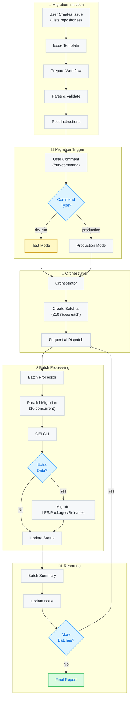
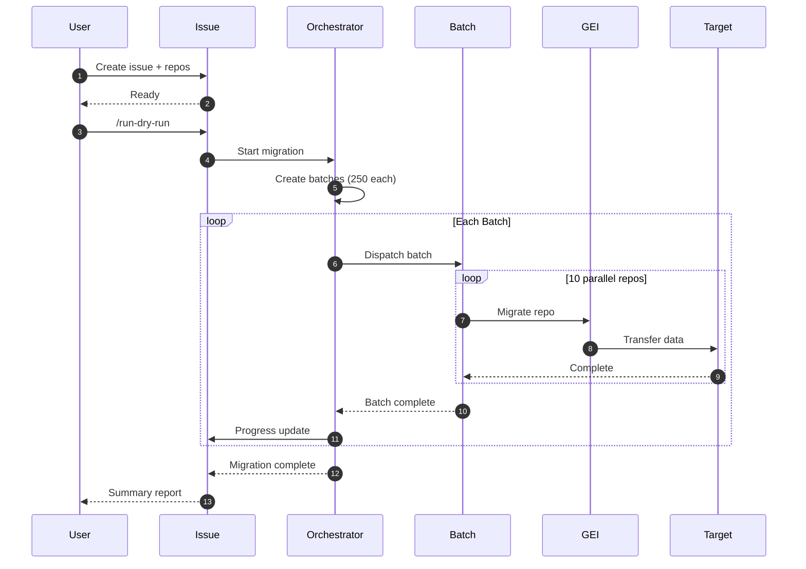

# 🚀 GitHub Enterprise Migration System

> **GitHub Actions Orchestration Framework for GEI-Based Repository Migrations**

[](https://github.com)
[](https://docs.github.com/en/migrations/using-github-enterprise-importer)
[](https://github.com)

An automation framework for GitHub repository migrations using GEI (GitHub Enterprise Importer). Handles batch processing of up to 8,000+ repositories with intelligent parallelization (10 concurrent), sequential batch execution (250 repos/batch), and comprehensive asset migration including Git history, LFS objects, releases, packages, secrets, variables, and deployment environments. Supports GHES-to-GHEC and GHEC-to-GHEC migrations with dry-run validation and production locking capabilities.

## ✨ Key Features

| Feature | Description |
|---------|------------|
| 📋 **Issue-Driven Workflow** | Create an issue, list your repos, and let automation handle the rest |
| 📦 **Smart Batching** | Automatically splits large migrations into manageable chunks (250 repos/batch) |
| 🔄 **Sequential Processing** | Reliable batch-by-batch execution with progress tracking |
| 🧪 **Dry-Run Support** | Test migrations safely before production |
| 🔒 **Production Mode** | Secure migration with source repository locking |
| 💾 **Complete Data Transfer** | Includes LFS, packages, and releases |
| 💬 **Real-Time Updates** | Progress notifications via issue comments |
| 🛑 **Cancellation Support** | Stop migrations gracefully with `/cancel-migration` |
| 👥 **User Mapping** | Automatic mannequin-to-user account mapping |
| 🔧 **Self-Service** | Empower teams to run their own migrations |

## 🎯 Quick Start

### 📋 Prerequisites

- ✅ GitHub Enterprise Cloud organization (target)
- ✅ Admin access to source and target
- ✅ Personal Access Tokens (PATs)
- ✅ Storage backend (Azure Blob or AWS S3) - optional but recommended
- ✅ Self-hosted runners (for batch processing)

### 🔧 Setup Instructions

#### 1️⃣ **Fork & Configure Repository**

```bash
# Fork this repository to your organization
# Clone to your local machine
git clone https://github.com/YOUR-ORG/migration-system.git
cd migration-system
```

#### 2️⃣ **Configure Secrets** 🔐

Navigate to **Settings** → **Secrets and variables** → **Actions**

| Secret | Description | Required |
|--------|-------------|----------|
| `TARGET_ADMIN_TOKEN` | PAT for target org with `repo`, `admin:org`, `workflow` scopes | ✅ |
| `SOURCE_ADMIN_TOKEN` | PAT for source with `repo`, `admin:org` scopes | ✅ |
| `AZURE_STORAGE_CONNECTION_STRING` | Azure storage connection string | Choose one |
| `AWS_ACCESS_KEY_ID` | AWS access key | storage option |
| `AWS_SECRET_ACCESS_KEY` | AWS secret key | (optional) |

#### 3️⃣ **Configure Variables** ⚙️

Navigate to **Settings** → **Secrets and variables** → **Actions** → **Variables**

| Variable | Description | Example | Required |
|----------|-------------|---------|----------|
| `TARGET_ORGANIZATION` | Target GitHub org name | `my-company` | ✅ |
| `SOURCE_ORGANIZATION` | Source org (for releases/environments) | `old-company` | ✅ |
| `INSTALL_PREREQS` | Auto-install dependencies | `true` | ✅ |
| `LOCAL_CACHE_DIR` | Local cache directory for migrations | `/opt/migration` | ⚙️ Optional |
| `AWS_REGION` | AWS region (if using S3) | `us-east-1` | ⚙️ Optional |
| `AWS_BUCKET_NAME` | S3 bucket name (if using S3) | `migrations` | ⚙️ Optional |

> **Note**: `LOCAL_CACHE_DIR` defaults to `/opt/migration` if not specified. Used for caching migration artifacts on self-hosted runners.

#### 4️⃣ **Optional: Prepare Support Files** 📁

<details>
<summary>📦 For repositories with special requirements</summary>

Create these CSV files in your repository root:

**`lfs.csv`** - Repositories requiring LFS migration
```csv
repository
repo-with-lfs
another-lfs-repo
```

**`packages.csv`** - Repositories with packages
```csv
repository
repo-with-packages
```

**`user-mappings-gei.csv`** - Map mannequins to real users
```csv
source,target
old-username,new-username
```

**Note**: LFS/packages/releases migrations are scaffolded but need uncommenting in workflow files for production use.

</details>

## 🚀 Running Your Migration

### Step 1: Create Migration Issue 📝

1. Go to **Issues** → **New Issue**
2. Select **"🚀 Migrate Repositories to GitHub Enterprise Cloud"** template
3. Add your repositories:

```markdown
<details>
<summary>📋 Repository List (click to expand)</summary>

https://github.example.com/org/repo1
https://github.example.com/org/repo2
https://github.example.com/org/repo3

</details>
```

4. Select visibility: `Private`, or `Internal`
5. Submit the issue

### Step 2: Review Automated Analysis 🔍

The system will automatically comment with:
- ✅ Number of repositories detected
- 📦 Batch breakdown (250 repos per batch)
- 🎯 Target organization confirmation
- 👁️ Visibility settings

### Step 3: Start Migration 🎬

Add a comment to your issue:

#### 🧪 **Test First (Recommended)**
```
/run-dry-run-migration
```
- ✅ Safe, non-destructive test
- ✅ Creates test repos (GEI handles naming)
- ✅ Source remains unlocked

#### 🚀 **Production Migration**
```
/run-production-migration
```
- ⚠️ Locks source repositories
- ✅ Creates production repos
- ✅ Run after successful dry-run

### Step 4: Monitor Progress 📊

Watch real-time updates in your issue:

```
🚀 Batch 1 of 10 Starting
📦 Repositories in this batch: 250
🔄 Migration type: dry-run
🎯 Target organization: `my-company`

➡️ Track batch progress in Actions tab

✅ Batch 1 of 10 Complete
🎉 Status: SUCCESS
⏱️ Duration: 250 minutes

📥 Next: Preparing batch 2...
```

### Step 5: Post-Migration 🎉

After successful migration:
- 📋 Review the final report
- 🔍 Verify all repositories
- 👥 Update team access
- 🔧 Configure CI/CD
- 🧹 Clean up dry-run repos with `/delete-dry-run`

## 🖥️ Infrastructure Setup

### **Runner Architecture Overview**

This migration system uses GitHub Actions self-hosted runners with three distinct layers:

#### **1. Orchestrator Layer** (1 runner)
- Handles batch creation and sequential dispatch
- Coordinates the entire migration workflow
- Posts updates to GitHub issues
- **Label**: `ubuntu-latest` or `self-hosted`
- **Runs on**: GitHub-hosted or self-hosted

#### **2. Batch Processing Layer** (1-10 runners)
- Executes GEI repository migrations
- **Minimum**: 1 runner (sequential migrations)
- **Recommended**: 10 runners (full parallelization - 10 repos migrate simultaneously)
- **Label**: `self-hosted`
- Scalable based on desired concurrency

#### **3. Feature Migration Layer** (0-5+ runners per feature)
- **LFS Migration**: Separate runners (optional)
- **Releases Migration**: Separate runners (optional)
- **Packages Migration**: Separate runners (optional)
- **Variables/Secrets Migration**: Separate runners (optional)
- **Environments Migration**: Separate runners (optional)
- Can reuse batch processor runners or have dedicated runners for concurrency

### **Minimum Runner Requirements**

| Scenario | Orchestrator | Batch Processor | Feature Migrations | Total |
|----------|--------------|-----------------|-------------------|-------|
| **Minimal** (sequential) | 1 | 1 | 0 (reuse batch) | **2** |
| **Standard** (10x parallel) | 1 | 10 | 0 (reuse batch) | **11** |
| **Full Concurrent** (10x + dedicated features) | 1 | 10 | 5 (1 per feature) | **16** |
| **Maximum Throughput** | 1 | 10 | 10+ (concurrent features) | **21+** |

### **Physical Machine Deployment**

**Important**: These runners don't need to be separate machines. Multiple runner processes can run on the same hardware.

#### **Option 1: Single Machine (Recommended)**
```
One powerful server running all 16 runners:
├── 1 orchestrator runner process
├── 10 batch processor runner processes
└── 5 feature migration runner processes

All registered with appropriate labels, sharing:
- CPU, memory, disk, network
- Local disk access to /opt/migration
```

**Recommended specs for 16 concurrent runners:**
- **CPU**: 32+ cores (2 per runner minimum)
- **Memory**: 64+ GB RAM (4GB per runner minimum)
- **Disk**: Fast SSD with sufficient space for `LOCAL_CACHE_DIR`
- **Network**: High bandwidth for GitHub API operations

#### **Option 2: Distributed Deployment**
```
Machine A: Orchestrator + 10 batch processors
Machine B: LFS migration runners (local /opt/migration)
Machine C: Releases migration runners (local /opt/migration)
```

### **Scaling Recommendations**

| Migration Size | Physical Machines | Runner Configuration |
|----------------|-------------------|---------------------|
| < 100 repos | 1 machine | 1 orchestrator + 5 batch processors |
| 100-1000 repos | 1 machine | 1 orchestrator + 10 batch processors |
| 1000-5000 repos | 1-2 machines | 1 orchestrator + 10 batch + dedicated features |
| 5000+ repos | 2-3 machines | Distribute batch processors, dedicated feature runners |

## 💾 Storage & Caching

### **Local Cache Directory**

The `LOCAL_CACHE_DIR` (default: `/opt/migration`) is used for caching migration artifacts and feature detection.

#### **Who needs `LOCAL_CACHE_DIR`:**
- ❌ **Orchestrator** - Does NOT need access
- ✅ **Batch processors** - Needs access to check for cached releases and trigger feature migrations
- ✅ **LFS migration runners**
- ✅ **Releases migration runners**
- ✅ **Packages migration runners**
- ✅ **Variables/Secrets runners**
- ✅ **Environments runners**

#### **Deployment Implications:**
- **Single machine**: All runners automatically share local `/opt/migration`
- **Multiple machines**: Each machine running batch processors or feature migrations needs its own local `/opt/migration`
- **No network storage required**: Each runner uses local disk only

#### **Storage Recommendations:**
- Ensure sufficient disk space (varies by repository size)
- Use SSD for better performance
- Regular cleanup recommended after migrations

### **Pre-Migration Cache Preparation**

**Optional but recommended**: Pre-populate the `LOCAL_CACHE_DIR` before running migrations to optimize performance.

#### **Available GH Migration Tools**

Each tool has comprehensive documentation covering installation, configuration, advanced options, and troubleshooting:

- **[gh-migrate-releases](https://github.com/mona-actions/gh-migrate-releases)** - Export and sync repository releases
- **[gh-migrate-lfs](https://github.com/mona-actions/gh-migrate-lfs)** - Export and sync Git LFS objects
- **[gh-migrate-packages](https://github.com/mona-actions/gh-migrate-packages)** - Export and sync packages (npm, Maven, NuGet, etc.)
- **[gh-migrate-environments](https://github.com/mona-actions/gh-migrate-environments)** - Export and sync deployment environments

> **Note**: Refer to each tool's documentation for detailed usage instructions, installation steps, and advanced configuration options.

#### **Benefits of Pre-Caching**
- ⚡ Faster migration execution (data already local)
- 🔄 Reduced API calls during migration workflows
- 📊 Better parallelization (no export bottleneck)
- 🎯 Validate data integrity before migration

**Note**: The migration workflows will automatically handle exports if data is not pre-cached, but pre-caching can significantly improve performance for large-scale migrations.

### **GEI Storage Backend (Azure/AWS)**

GEI requires a storage backend for temporary migration data during the repository transfer process.

#### **Configuration Options:**

**Azure Blob Storage:**
- Set `AZURE_STORAGE_CONNECTION_STRING` secret
- Recommended for Azure-hosted infrastructure

**AWS S3:**
- Set `AWS_ACCESS_KEY_ID` and `AWS_SECRET_ACCESS_KEY` secrets
- Set `AWS_REGION` and `AWS_BUCKET_NAME` variables
- Recommended for AWS-hosted infrastructure

**Note**: This is separate from `LOCAL_CACHE_DIR` and is used by GEI for the actual repository migration process.

## 🎛️ Advanced Configuration

### ⚙️ Customize Batch Size

Edit workflow configuration for your needs:

```yaml
# .github/workflows/trigger.yml
BATCH_SIZE: 250  # Max 256 (GitHub Actions matrix limit)
```

### 🔄 Parallel Processing

Control concurrent migrations per batch:

```yaml
# .github/workflows/batch-processor.yml
max-parallel: 10  # Max 10 (GEI concurrent limit)
```

### ⏱️ Timeout Configuration

For large repositories:

```yaml
timeout-minutes: 50400  # 35 days (GitHub Actions max)
```

### 🔐 Variables & Secrets Migration

**Automatic detection and migration** - no configuration needed!

The system automatically:
1. ✅ Detects repository variables and secrets
2. ✅ Migrates variables with actual values
3. ✅ Creates placeholder secrets (security requirement)
4. ⚠️ Reports which secrets need manual updates

**Post-migration checklist:**
- Review placeholder secrets in target repository
- Update with actual secret values
- Verify variable values transferred correctly

### 🌍 Environments Migration

**Automatically migrates deployment environments** including:
- Protection rules (wait timers, required reviewers)
- Deployment branch policies
- Custom protection rules

**Prerequisites:**
- Repositories must exist in target org (done via main migration)
- Secrets should be migrated first (done automatically)

**Note**: Environment secrets follow the same placeholder pattern as repository secrets and require manual update.

## 🛠️ Troubleshooting

### 🚨 Common Issues & Solutions

<details>
<summary>🔴 Migration Won't Start</summary>

**Checklist:**
- ✅ Verify PAT permissions
- ✅ Check secret names match exactly
- ✅ Ensure issue has `migration` and `batch` labels
- ✅ Confirm user has write access

</details>

<details>
<summary>🟡 Batch Processing Stops</summary>

**Steps:**
1. Check Actions tab for error details
2. Verify runner availability (if self-hosted)
3. Check API rate limits
4. Re-run failed batch from Actions

</details>

<details>
<summary>🔵 Missing LFS/Packages</summary>

**Note:** These features need activation:
1. Edit workflow files (lfs.yml, packages.yml, releases.yml)
2. Uncomment the migration commands
3. Ensure CSV files exist with repo names

</details>

### 🛑 Emergency Controls

**Cancel in-progress migration:**
```
/cancel-migration
```

**Clean up dry-run test repositories:**
```
/delete-dry-run
```
Safely removes all repositories created during dry-run testing.

**Clean up specific repositories:**
```
/delete-repositories
```
Requires confirmation before deletion. Use with caution!

**Re-run specific batch:**
1. Go to Actions tab
2. Find failed batch workflow
3. Click "Re-run failed jobs"

## 📊 Architecture & Monitoring

### **Key Metrics Location**

| Metric | Where to Find |
|--------|--------------|
| 📈 Overall Progress | Issue comments |
| 🔍 Detailed Logs | Actions tab → Workflow runs |
| 📋 Batch Results | Workflow summaries |
| 🗂️ Migration Artifacts | Configured storage (Azure/S3) |

### **Architecture Overview**



### **Migration Flow**



### **Performance at Scale**

| Scale | Repositories | Batches | Est. Time | Parallel Factor |
|-------|-------------|---------|-----------|-----------------|
| Small | 10 | 1 | ~10 min | 10x |
| Medium | 250 | 1 | ~250 min | 10x |
| Large | 1000 | 4 | ~17 hours | 10x |
| Enterprise | 8000 | 32 | ~5.5 days | 10x |

**Time Formula**: `(repos_per_batch ÷ 10 parallel) × 10 min/repo + 2 min overhead`

## 🔒 Security Best Practices

### 🛡️ Token Security
- 🔑 Use repository secrets only
- 🔄 Rotate tokens post-migration
- 🎯 Minimum required permissions

### 👥 Access Control
- 🚪 Restrict issue creation permissions
- 🔒 Limit repository access during migration
- 👁️ Review permissions post-migration

### 💾 Data Handling
- 🗄️ Temporary storage in configured backend
- 🧹 Clean up after successful migration

## 📞 Support

Need help? 
1. 📖 Check [GEI documentation](https://docs.github.com/en/migrations/using-github-enterprise-importer)
2. 🔍 Review workflow logs
3. 💬 Open an issue with:
   - Error messages
   - Workflow run links
   - Configuration (exclude secrets!)

---

<div align="center">

**🎯 Built for Scale** | **🔧 Self-Service Ready** | **📊 Full Visibility**

Made with ❤️ for GitHub Enterprise migrations

[Documentation](https://docs.github.com/en/migrations) | [Support](https://support.github.com) | [GEI CLI](https://github.com/github/gh-gei)

</div>

